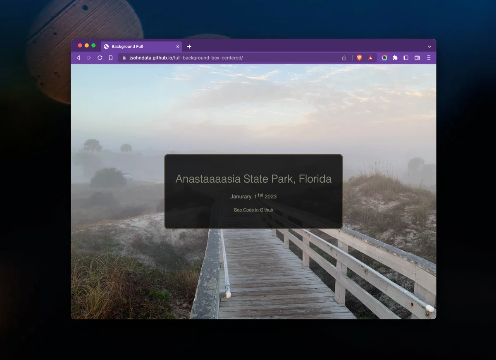

# Full Background Box Centered

A simple HTML/CSS to center a box with a full background.

 

## Site
* 👉  [jsohndata.github.io/full-background-box-centered](https://jsohndata.github.io/full-background-box-centered/)

